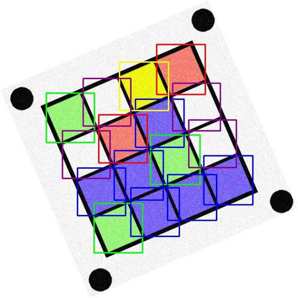

Image Processing Lab Report 

Images are imported and converted into HSV scale in order to be able to accurately detect colours. 

Upper and lower boundaries for each used colour are defined and then used to create masks which will be applied to the test images in order to isolate and only leave the target colors (Red, Blue, Green, Yellow, Green)   

Rectangle contours are then drawn around shapes of reasonable surface are (squares whos colours to be detected) using mask defined above.  

Squares realignment algorithm. Using contours rectangles position in the image and sorting them left to right and top to down. Assigning each a value (R, G, B, Y, W) to each drawn contour and storing in a dictionary. Construct 4x4 matrice from sorted dictionary. (Unfortunatley due to limited time frame as I am submitting on the late submission period I stopped at the making the dictionary step) 

Results of the detection are shown from the drawn detected contours 

Code 

import cv2 

import numpy as np 

import os 

def get\_sorting\_factor(contour, cols):     origin = cv2.boundingRect(contour)     return origin[1] \* cols + origin[0] 

def colourMatrix(filename): 

`    `original = cv2.imread(filename)     imageFrame = cv2.imread(filename) 

hsvFrame = cv2.cvtColor(imageFrame, cv2.COLOR\_BGR2HSV) 

#Red color boundries and mask 

red\_lower1 = np.array([0, 50, 20], np.uint8) red\_upper1 = np.array([10, 255, 255], np.uint8) red\_lower2 = np.array([170, 50, 20], np.uint8) red\_upper2 = np.array([180, 255, 255], np.uint8) red\_mask1 = cv2.inRange(hsvFrame, red\_lower1, red\_upper1) red\_mask2 = cv2.inRange(hsvFrame, red\_lower2, red\_upper2) red\_mask = cv2.bitwise\_or(red\_mask1, red\_mask2) 

#Green color boundries and mask 

green\_lower = np.array([38, 50, 20], np.uint8) 

green\_upper = np.array([70, 255, 255], np.uint8) 

green\_mask = cv2.inRange(hsvFrame, green\_lower, green\_upper) 

#Blue color boundries and mask 

blue\_lower = np.array([98, 50, 20], np.uint8) 

blue\_upper = np.array([125, 255, 255], np.uint8) blue\_mask = cv2.inRange(hsvFrame, blue\_lower, blue\_upper) 

#Yellow color boundries and mask 

yellow\_lower = np.array([20, 50, 20], np.uint8) 

yellow\_upper = np.array([35, 255, 255], np.uint8) 

yellow\_mask = cv2.inRange(hsvFrame, yellow\_lower, yellow\_upper) 

#White color boundries and mask 

white\_lower = np.array([0, 0, 239], np.uint8) 

white\_upper = np.array([178, 52, 255], np.uint8) 

white\_mask = cv2.inRange(hsvFrame, white\_lower, white\_upper) 

`    `squares = [] 

`    `CNTS = {} 

`    `#Finding red coloured squares 

`    `contours, hierarchy = cv2.findContours(red\_mask, cv2.RETR\_TREE, cv2.CHAIN\_ APPROX\_SIMPLE)[-![ref1]2:] 

`    `for pic, contour in enumerate(contours):         area = cv2.contourArea(contour) 

`        `if(area > 1200): 

`            `x, y, w, h = cv2.boundingRect(contour) 

`            `imageFrame = cv2.rectangle(imageFrame, (x, y), (x + w, y + h), (0,  0, 255), 2) 

`            `square = ['r',x,y] 

`            `CNTS['r']=[contour] 

`            `squares.append(square)   

`    `##CNTS.sort(key=lambda z:get\_sorting\_factor(z, imageFrame.shape[1])) 

`    `#Finding green coloured squares 

`    `contours, hierarchy = cv2.findContours(green\_mask,cv2.RETR\_TREE,cv2.CHAIN\_ APPROX\_SIMPLE)[-2:] 

`    `for pic, contour in enumerate(contours):         area = cv2.contourArea(contour) 

`        `if(area > 900): 

`            `x, y, w, h = cv2.boundingRect(contour) 

`            `imageFrame = cv2.rectangle(imageFrame, (x, y),  (x + w, y + h),(0,  255, 0), 2) 

`            `square = ['g',x,y] 

`            `CNTS['g']=[contour] 

`            `squares.append(square) 

`    `##CNTS.sort(key=lambda z:get\_sorting\_factor(z, imageFrame.shape[1])) 

`    `#Finding blue coloured squares 

`    `contours, hierarchy = cv2.findContours(blue\_mask,cv2.RETR\_TREE,cv2.CHAIN\_A PPROX\_SIMPLE)[-2:] 

`    `for pic, contour in enumerate(contours): 

`        `area = cv2.contourArea(contour) 

`        `if(area > 300): 

`            `x, y, w, h = cv2.boundingRect(contour) 

`            `imageFrame = cv2.rectangle(imageFrame, (x, y), (x + w, y + h),(255 ,0,0), 2) 

`            `square = ['b',x,y] 

`            `CNTS['b']=[contour] 

`            `squares.append(square) 

`    `##CNTS.sort(key=lambda z:get\_sorting\_factor(z, imageFrame.shape[1])) 

`    `#Finding yellow coloured squares 

`    `contours, hierarchy = cv2.findContours(yellow\_mask,cv2.RETR\_TREE,cv2.CHAIN \_APPROX\_SIMPLE)[-2:] 

`    `for pic, contour in enumerate(contours): 

`        `area = cv2.contourArea(contour) 

`        `if(area > 300): 

`            `x, y, w, h = cv2.boundingRect(contour) 

`            `imageFrame = cv2.rectangle(imageFrame, (x, y), (x + w, y + h),(0,2 55,255), 2) 

`            `square = ['y',x,y] 

`            `CNTS['y']=[contour] 

`            `squares.append(square) 

`    `##CNTS.sort(key=lambda z:get\_sorting\_factor(z, imageFrame.shape[1])) 

`    `#Finding white coloured squares 

`    `contours, hierarchy = cv2.findContours(white\_mask,cv2.RETR\_TREE,cv2.CHAIN\_ APPROX\_SIMPLE)[-2:] 

`    `for pic, contour in enumerate(contours): 

`        `area = cv2.contourArea(contour) 

`        `if(10000 > area > 3000): 

`            `x, y, w, h = cv2.boundingRect(contour) 

`            `imageFrame = cv2.rectangle(imageFrame, (x, y), (x + w, y + h),(139 ,0,139), 2) 

`            `square = ['w',x,y] 

`            `squares.append(square) 

`            `CNTS['w']=[contour] 

`    `##CNTS.sort(key=lambda z:get\_sorting\_factor(z, imageFrame.shape[1])) 

`    `i = 0 

`    `A=[] 

`    `while(i<4): 

`        `c,x,y = 'x',square[1],square[2] 

`        `for square in squares: 

`            `if(square[1] > x and square[2] < y): 

`                `c,x,y = square[0],square[1],square[2]         A.append([c,x,y]) 

`        `i += 1 

print(filename + " " + str(CNTS[1])) return imageFrame 

#Saves result images to folder to verify detection as i didn't finish 4x4 matr ix![ref1] 

testImages = 'images2/' 

results = 'results/' 

for image in os.listdir(testImages): 

`    `if image.endswith(".png"):   

`        `result = colourMatrix(testImages + image) 

`        `cv2.imwrite(os.path.join(results , image), result) 

[ref1]: Aspose.Words.4d50ca76-c514-47b1-82bc-c189bb4376f9.034.png
